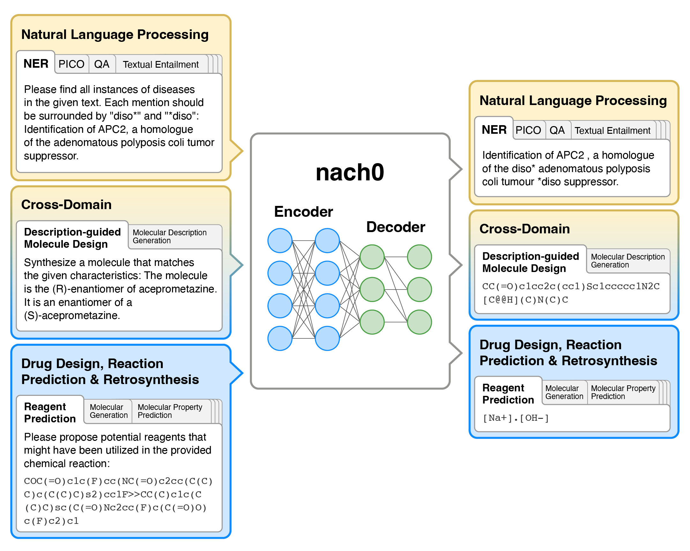
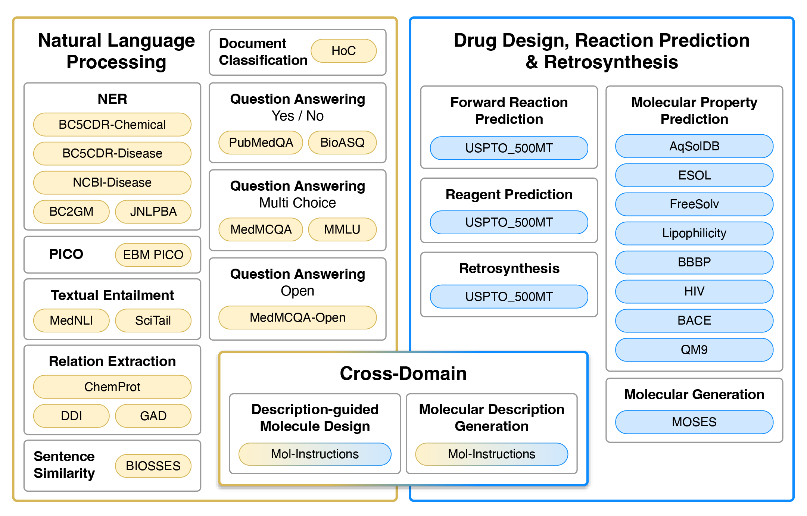

<h1 align="center"> nach0  </h1>
<h3 align="center"> Multimodal Natural and Chemical Languages Foundation Model </h3>
<p align="center">
  📃 <a href="https://arxiv.org/abs/2311.12410" target="_blank">Paper</a> • ⏬ <a href="https://huggingface.co/datasets/insilicomedicine/nach0" target="_blank">Base nach0</a> • ⏬ <a href="https://huggingface.co/datasets/insilicomedicine/nach0" target="_blank">Large nach0</a> <br>
</p>
<div align=center></div>
<h2 id="1">Overview</h2>


<h2 id="1">Tasks</h2>
Datasets used for training and evaluation. Colour represents the type of tasks. Yellow and blue datasets are single-domain, typically requiring regression/classification losses or generation in the target domain (natural language or SMILES strings). Gradients from yellow to blue represent cross-domain generation tasks that require natural language input and SMILES output, or vise versa.
<div align=center></div>


<h3> References</h3>
If you use our repository, please cite the following related paper:

```
@inproceedings{....
}
```
